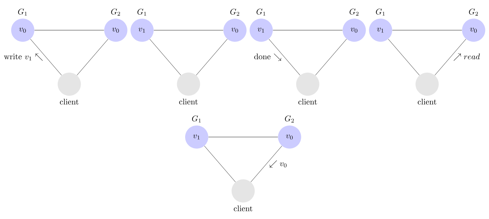

# postgresql replication book - hansjurgen schonig

## distributed systems

- cap theorem
  - consistency
  - availability
  - partition tolerance
  

- ***consistency***
  - ***It's a logical property of the DB, independent of the actual data (out of data).***
  - ex: something tells that something is written in database but it is false!

> - ***integrity***
>   - ***That's not logically invalid, but it is invalid relative to the rules that govern data content.***
>   - ex: some database data are wrong (id should be 1 but is 2)!

- **availability**
  - accessing data all of the time

- **partition tolerance**
  - the major network can continue to work without problem
  while some nodes are partitioned in network!

> (theoritically) ***REPLICATED SYSTEMS CAN ONLY PROVIDE 2 OF 3 FROM CAP*** (theoritically)

- SEE THE PROOF HERE:
  - [https://mwhittaker.github.io/blog/an_illustrated_proof_of_the_cap_theorem/](https://mwhittaker.github.io/blog/an_illustrated_proof_of_the_cap_theorem/)

- some examples:
  - consistency + availability: postgresql, mysql, oracle, (almost all relationals)
  - consistency + partition tolerance: mongodb, elasticsearch, cockroachdb
  - availability + partition tolerance: apache casandra, dynamodb

- The most important point you have to keep in mind here is that bandwidth is not
always the magical fix to a performance problem in a replicated environment. In
many setups, latency is at least as important as bandwidth.
